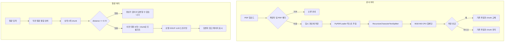

# Local PDF RAG Chatbot

로컬 PDF를 업로드하고, 해당 문서 내용만으로 질의응답하는 Flask 웹앱입니다. 답변 생성과 임베딩은 모두 이 컴퓨터에서 실행하며 외부 채팅 API는 사용하지 않습니다.

개발 중 확인한 사용 시나리오는 다음과 같습니다. 연구 자료나 회의 자료처럼 텍스트가 있는 PDF를 올린 뒤, 문서에 적힌 내용에 대해 질문하고 참고 페이지를 확인합니다.

## 주요 기능

코드와 이 컴퓨터에서의 실행으로 확인한 기능만 적습니다.

- 왼쪽 사이드바에서 PDF 다중 업로드, 드래그 앤 드롭 지원
- 확장자가 `.pdf`가 아니거나 파일 헤더에 `%PDF`가 없으면 거부
- 파일당 최대 50MB
- 오른쪽 채팅창에서 질문 입력, Enter 또는 전송 버튼으로 제출
- `Shift+Enter`는 줄바꿈, 한글 IME 조합 중 Enter는 전송하지 않음
- `llama-cpp-python`으로 로컬 GGUF LLM 실행
- `PyPDFLoader`로 텍스트 추출 후 `RecursiveCharacterTextSplitter`로 분할 (`chunk_size=500`, `chunk_overlap=100`)
- 문단(`\n\n`, `\n`)과 문장(`. `, `? `, `! `)을 먼저 자르고, 그다음 공백과 문자 단위로 분할
- ChromaDB에 임베딩을 `chroma_db/`에 영속 저장
- 질문과 유사한 상위 4개 chunk를 검색하고, cosine distance가 0.72보다 큰 결과는 제외
- 관련 chunk가 없으면 모델 호출 없이 `정보가 없어서 답변할 수 없습니다`만 반환
- 답변 하단에 참고 chunk 발췌(최대 180자)와 페이지 번호 표시
- 서버 메모리의 최근 대화 8개를 프롬프트에 넣고, 직전 사용자 질문을 검색어에 덧붙임
- 새 대화 버튼은 메모리만 지움. 업로드된 문서와 벡터 DB는 유지
- 업로드는 백그라운드 작업으로 처리하고, 화면은 대기/처리 중/완료/실패와 단계(텍스트 추출, 청킹, 임베딩, 벡터 저장)를 조회
- 같은 이름 PDF는 검증과 임베딩이 끝난 뒤에만 기존 파일·chunk를 교체. 실패하면 기존 데이터를 유지
- 모델 오류 후에도 `모델 다시 시도`로 상태를 다시 확인
- 처리 중 중복 전송 방지, 빈 질문 무시, 오류 후 다시 전송 가능
- 파일명과 발췌는 텍스트로만 표시

확인하지 않은 기능은 넣지 않았습니다. 이미지 스캔 PDF OCR, GPU 가속 추론, 대화 기록 파일 저장, 외부 API 호출은 구현되어 있지 않습니다.

## 기술 스택

| 기술 | 역할 |
| --- | --- |
| Flask 3.1.3 | 웹 서버, 업로드/채팅/상태 API |
| LangChain Community / Classic | PDF 로더, HuggingFace 임베딩, LlamaCpp 래퍼, 대화 메모리 |
| LangChain Text Splitters | RecursiveCharacterTextSplitter |
| LangChain Chroma 1.1.0 + ChromaDB 1.3.5 | 벡터 저장과 유사도 검색 |
| llama-cpp-python 0.3.33 | 로컬 GGUF LLM 추론 |
| sentence-transformers / transformers / torch | BGE-M3 임베딩 로드 |
| pypdf | PDF 텍스트 추출 (PyPDFLoader 내부) |
| HTML / CSS / JavaScript | 사이드바 업로드와 채팅 UI |

## 동작 구조



## 폴더 구조

```text
local_rag/
  app.py                 # Flask 라우트와 업로드/채팅 API
  config.py              # 경로, 청킹, 검색, 제한값
  rag_engine.py          # 임베딩, 벡터 DB, LLM, 검색, 스트리밍 답변
  jobs.py                # 업로드 백그라운드 작업 상태
  requirements.txt       # 검증된 패키지 버전
  tests/                 # 교체 안전성·작업·API 로직 테스트
  start.bat              # Windows 실행 스크립트
  templates/index.html   # 화면 구조
  static/app.js          # 업로드, 전송, 스트리밍 UI
  static/style.css       # 화면 스타일
  models/README.md       # 모델 파일명과 배치 경로
  models/exaone_2.4b/    # GGUF LLM (Git 제외)
  models/bge-m3/         # SentenceTransformer 임베딩 (Git 제외)
  uploads/               # 업로드 PDF (Git 제외)
  chroma_db/             # 벡터 DB (Git 제외)
```

경로 상수는 `config.py`의 `BASE_DIR = Path(__file__).resolve().parent`를 기준으로 만듭니다. 실행 위치가 달라도 프로젝트 폴더의 `models/`, `uploads/`, `chroma_db/`를 찾습니다.

## 설치 및 실행

이 저장소에는 모델 가중치, 업로드 PDF, ChromaDB 데이터가 없습니다. 코드와 설정만 내려받은 뒤 모델을 따로 준비합니다.

### 1. 저장소 내려받기

```bat
git clone https://github.com/sngbae12/Local-RAG-project.git
cd Local-RAG-project
```

### 2. Python 환경

이 컴퓨터에서 확인한 실행 환경은 **Python 3.11 (Windows)** 입니다. 다른 버전은 여기서 검증하지 않았습니다.

```bat
python -m venv .venv
.venv\Scripts\activate
```

### 3. 의존성 설치

`requirements.txt`의 버전을 사용합니다. `llama-cpp-python`은 CPU 휠 인덱스를 함께 지정합니다. NVIDIA 드라이버가 없는 환경에서 CUDA 빌드를 쓰면 `llama.dll` 의존성 오류가 났습니다.

호환 조합은 `langchain-chroma==1.1.0`과 `chromadb==1.3.5`입니다. `langchain-chroma 1.1.0`이 `chromadb>=1.3.5,<2.0.0`을 요구하므로, 최신이 아니라 충족하는 최소 버전으로 `1.3.5`를 선택했습니다. 다른 패키지 버전은 바꾸지 않았습니다.

```bat
python -m pip install -r requirements.txt
python -m pip check
```

설치에는 인터넷이 필요합니다. `torch`와 관련 패키지 용량이 큽니다.

### 4. 모델 준비

| 용도 | 경로 | 형식 |
| --- | --- | --- |
| LLM | `models/exaone_2.4b/EXAONE-3.5-2.4B-Instruct-Q5_K_M.gguf` | GGUF, 이 환경 파일 크기 약 1.91GB |
| 임베딩 | `models/bge-m3/` | HuggingFace/SentenceTransformer 폴더. 이 환경의 `pytorch_model.bin` 약 2.27GB |

임베딩은 GGUF가 아닙니다. `HuggingFaceEmbeddings`가 `models/bge-m3`를 `local_files_only=True`, `device="cpu"`로 읽습니다.

BGE-M3 공개 위치는 로컬 모델 카드 기준 [BAAI/bge-m3](https://huggingface.co/BAAI/bge-m3) 입니다.

```bat
huggingface-cli download BAAI/bge-m3 --local-dir models/bge-m3
```

EXAONE GGUF는 Hugging Face 카드 [LGAI-EXAONE/EXAONE-3.5-2.4B-Instruct-GGUF](https://huggingface.co/LGAI-EXAONE/EXAONE-3.5-2.4B-Instruct-GGUF)에서 `Q5_K_M`을 제공합니다. 이용 조건은 카드의 EXAONE AI Model License Agreement 1.1 - NC를 확인하세요.

```bat
huggingface-cli download LGAI-EXAONE/EXAONE-3.5-2.4B-Instruct-GGUF EXAONE-3.5-2.4B-Instruct-Q5_K_M.gguf --local-dir models/exaone_2.4b
```

상세 파일 목록은 `models/README.md`를 보세요.

### 5. 실행과 접속

프로젝트 폴더에서:

```bat
start.bat
```

또는 가상환경을 켠 뒤:

```bat
python app.py
```

브라우저 주소: [http://127.0.0.1:5050/](http://127.0.0.1:5050/)

`start.bat`은 프로젝트 폴더로 이동한 다음, `.venv\Scripts\python.exe`가 있으면 그 Python을 씁니다. Python, `app.py`, 모델 파일, 필수 패키지가 없으면 이유를 출력하고 창을 닫지 않습니다.

## 사용 방법

1. 서버를 실행하고 배지가 **준비됨**인지 확인합니다. 오류가 보이면 `모델 다시 시도`를 누릅니다.
2. 왼쪽에서 PDF를 선택하거나 끌어다 놓습니다. 여러 개를 한 번에 올릴 수 있습니다.
3. 업로드 버튼은 처리가 끝날 때까지 잠기고, 상태 칸에 텍스트 추출/청킹/임베딩/벡터 저장 단계가 표시됩니다. 질문 초안은 그 동안에도 작성할 수 있습니다.
4. 처리가 끝나면 파일명과 chunk 개수가 목록에 나타납니다. 같은 이름 파일이 실패하면 이전 PDF와 이전 chunk가 남습니다.
5. 오른쪽에 질문을 쓰고 Enter 또는 전송을 누릅니다. `Shift+Enter`는 줄바꿈입니다.
6. 답변 생성 중에는 `답변을 생성하는 중입니다…`가 보입니다. 끝나면 서버가 보낸 최종 답변과 참고 문서 발췌, 페이지가 붙습니다.
7. 문서와 관련 없는 질문이면 `정보가 없어서 답변할 수 없습니다`만 나옵니다.
8. **새 대화**는 화면과 서버 메모리의 대화만 지웁니다.

## 문제와 해결

개발 중 확인한 내용입니다. 원인과 수정은 코드와 이 컴퓨터에서의 재현을 기준으로 적습니다.

### 질문 입력 후 Enter / 전송이 되지 않음

- 현상: 글을 써도 Enter가 반응하지 않거나 전송 버튼이 꺼져 있었습니다.
- 확인된 코드: 전송 버튼이 비활성일 때 `form.requestSubmit()`을 호출하면 제출이 일어나지 않습니다. 버튼 비활성 조건이 `ready === false`와 연결되어 있으면 LLM이 준비되지 않은 동안 전송이 막힙니다.
- 수정: Enter와 버튼이 `sendChat()`을 직접 호출합니다. 한글 조합 중(`isComposing` 또는 keyCode 229)에는 전송하지 않습니다. 글자가 있으면 버튼을 켭니다. LLM이 준비되지 않았으면 토스트로 이유를 보여 주고 입력은 남깁니다.
- 검증: 이 컴퓨터에서 모델을 준비한 뒤 입력란에 질문을 넣으면 전송 버튼이 켜졌고, Enter로 사용자 메시지가 채팅에 올라갔습니다.

Enter 문제와 LLM 로딩 실패는 증상이 겹칠 수 있습니다. LLM이 준비되지 않으면 예전 코드에서는 버튼이 꺼진 채 제출이 무시되었습니다. 두 문제를 하나의 원인으로 단정하지는 않습니다.

### CUDA / llama.dll 로딩 실패

- 현상: `llama-cpp-python이 NVIDIA CUDA 라이브러리를 찾지 못해 GGUF LLM을 불러오지 못했습니다`가 보였습니다.
- 확인된 환경: 이 컴퓨터에는 `nvidia-smi`가 없고, 설치되어 있던 `llama-cpp-python` 폴더에 `ggml-cuda.dll`(약 748MB)이 있었습니다. `n_gpu_layers=0`이어도 CUDA 빌드 DLL이 로드되지 않았습니다.
- 수정: CPU 휠로 재설치했습니다. `requirements.txt` 첫 줄에 `https://abetlen.github.io/llama-cpp-python/whl/cpu`를 넣었습니다. 코드의 LLM 설정은 `n_gpu_layers=0`입니다.
- 검증: 재설치 후 `from llama_cpp import Llama`가 성공했고, `/api/status`가 `ready: true`, `llm_ready: true`를 반환했습니다.

## 성능과 한계

정식 벤치마크는 하지 않았습니다. 개발 중 이 컴퓨터에서 본 응답 시간은 **수초에서 약 1~2분**이었습니다.

지연은 PDF 용량만으로 예측하지 않습니다. 확인된 요인만 구분합니다.

- **PDF 임베딩 시간**: 페이지 수, 추출된 텍스트 길이, chunk 수, CPU 임베딩 속도에 영향을 받습니다. 업로드 직후 사이드바에 `임베딩 중…`이 표시됩니다.
- **질문 응답 시간**: 모델이 이미 메모리에 올라온 뒤에도, 검색, 프롬프트 길이(`n_ctx=4096`), 검색된 chunk, 이전 대화, `max_tokens=512` 출력이 영향을 줍니다. CPU에서 GGUF를 돌리므로 첫 토큰까지 시간이 걸릴 수 있습니다.
- **모델 로딩**: 서버 시작 시 백그라운드에서 임베딩과 LLM을 읽습니다. GGUF 약 1.91GB, BGE-M3 `pytorch_model.bin` 약 2.27GB입니다.
- **GPU**: 현재 코드는 LLM과 임베딩 모두 CPU입니다. GPU가 없어도 실행할 수 있습니다. CUDA 빌드 `llama-cpp-python`은 NVIDIA 런타임 없이 실패했습니다.
- **인터넷**: 패키지 설치와 모델 다운로드에 필요합니다. 모델이 로컬에 있으면 질문/답변 API를 쓰지 않습니다. Chroma가 익명 텔레메트리를 켜 두었다는 로그가 이 환경에서 보였습니다.
- **OCR**: 구현되어 있지 않습니다. 텍스트 레이어가 없는 이미지 PDF는 `텍스트를 추출할 수 없는 PDF입니다`로 건너뜁니다.
- **관련 정보 없음 판정**: 검색 점수가 임계값보다 나쁘면 정보가 없다고 봅니다. 문서에 답이 있어도 검색이 놓치면 같은 문구가 나옵니다. 반대로 거리만 가깝고 내용이 빗겨도 chunk가 넘어갈 수 있습니다.
- **출처 표시**: 검색된 chunk의 파일명, 페이지, 최대 180자 발췌입니다. 요약이 아니며 답변 문장의 사실 여부를 보장하지 않습니다.
- **페이지 번호**: 로더 메타데이터의 `page_number`가 있으면 그 값을 쓰고, 없으면 `page`(0부터)에 1을 더합니다.
- **대화 맥락**: 프로세스 메모리에만 있습니다. 서버를 끄면 사라집니다.

## 향후 개선 사항

- 이미지 PDF OCR
- CUDA가 있는 환경에서 GPU 레이어를 선택적으로 사용
- 대화 기록을 파일로 남길지 여부 결정과, 남기지 않을 때의 안내
- CUDA가 있는 환경에서 GPU 레이어를 선택적으로 사용하는 것은 이번 수정에 넣지 않았습니다.
- 모델 파일 존재 여부를 시작 화면에 더 구체적으로 표시
- CPU 환경에서 첫 토큰 대기 시간을 줄이기 위한 context/배치 조정 실험

## 검증 기록

| 항목 | 테스트 대역(로직) | 실제 모델/이 컴퓨터 | 다른 컴퓨터 |
| --- | --- | --- | --- |
| 새 가상환경 `pip install -r requirements.txt` | - | 확인. Python 3.11, `pip check` 통과, `chromadb 1.3.5` import | 미검증 |
| Flask 테스트 클라이언트(빈 질문, 재시도, 작업 404) | 확인 | - | 미검증 |
| 같은 이름 잘못된 PDF / 임베딩 실패 시 기존 파일·chunk 보존 | 확인 | 실제 모델 임베딩 경로에서는 미검증 | 미검증 |
| 다중 업로드 일부 실패 | 확인 | 미검증 | 미검증 |
| 업로드 작업 상태와 서버 재시작 시 작업 없음 | 확인 | 브라우저 장시간 업로드 UI는 미검증 | 미검증 |
| `done.answer` 최종 반영, 출처 중복 방지 | 스트림 이벤트 확인 / 프론트 코드 확인 | 실제 LLM 완료 화면은 미검증 | 미검증 |
| HTML 파일명·발췌 `textContent` 표시 | 프론트 코드 확인 | 브라우저 DOM 확인은 미검증 | 미검증 |
| Enter / Shift+Enter / 한글 IME | 프론트 코드 유지 확인 | 이전 세션에서 Enter 전송 확인. 이번 수정 후 브라우저 재확인은 미검증 | 미검증 |
| 기존 Chroma 데이터 | - | `chromadb 1.3.5`로 백업본을 열었을 때 collection `pdf_rag` count 331. 운영 `chroma_db/`는 수정하지 않음 | 미검증 |

실행 화면 캡처는 넣지 않았습니다. 이 컴퓨터의 실행 화면에 기존 업로드 문서명이 있습니다.
